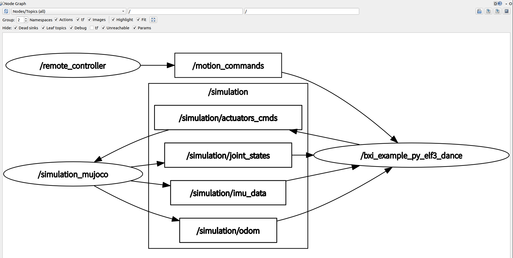
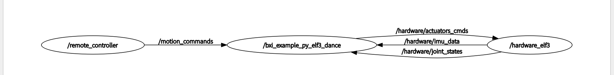

# bxi_rl_controller_ros2_example

[Chinese](./README.md)

## Overview

This repository provides a controller development framework for BXI robots, including:

* A sample controller program that deploys reinforcement-learning-based control policies;
* A Mujoco simulator based on ROS2;
* The BXI hardware environment based on ROS2;
* A ROS2 remote controller node that reads joystick or keyboard input.

## Package Structure

The binary ROS2 packages for the ROS2 environment and Mujoco are available in [`bxi_ros2_pkg`](https://github.com/bxirobotics/bxi_ros2_pkg).

In the binary ROS2 package directory `bxi_ros2_pkg/`:

1. `communication`: the robot communication package, including custom message formats.
2. `description`: robot description files, including URDF, XML, and mesh files.
3. `mujoco`: the Mujoco simulator based on ROS2. Controller programs are recommended to be verified in Mujoco before deployment to robot hardware.
4. `hardware`: the robot hardware package. This node publishes all robot sensor data and receives control commands.
5. `hardware_arm`: the hardware control package for the upper-body-only version of the robot. This node publishes upper-body arm information and receives control commands.

[`bxi_ros2_pkg`](https://github.com/bxirobotics/bxi_ros2_pkg) is a unified framework for both simulation and hardware:

ROS2 structure for simulation: 

ROS2 structure for hardware: 

The `src/` directory contains:

1. `src/bxi_example_py_elf3`: a demo of an Elf3 learning-based control policy.
2. `remote_controller`: reads joystick or keyboard input and publishes commands. It works with both robot hardware and the simulation environment.

## Description Files (URDF)

1. `elf3_dof29`: Elf3 with 29 DoF.
2. `elf3_dof31`: Elf3 with 31 DoF, including 2 DoF on the head.

For USD or XML formats, see [unofficial models](https://github.com/MelodyAI/TienKung-Lab-bxi/tree/main/legged_lab/assets/elf3_lite).

## Instructions

### Extended Documentation / Wiki

For adding remote controllers or input controllers, robot business states, state transitions, transition behaviors, `on_bind(ctx)` state subscription, and `get_cmd_vel(ctx)` velocity handling, see the project Wiki:

* GitHub Wiki: <https://github.com/bxirobotics/bxi_rl_controller_ros2_example/wiki>

### Switching Between Hardware and Simulation

1. `hw` is short for `hardware`. All `launch` files with the `hw` suffix launch real hardware. Use them carefully.
2. The simulation environment and robot hardware share the same control program. Use different launch files to switch between simulation and hardware. Topics for simulation use the `simulation/` prefix, while topics for hardware use the `hardware/` prefix. For details, see the topic parameter settings in `src/bxi_example_py_elf3`.
3. The robot in simulation starts with a virtual suspension. The suspension must be released after startup. Suspension-related signals are ignored when operating robot hardware.
4. There is a global odometer topic `odm` in the simulation environment. This topic is not available in the `hardware` environment.

### System Environment Setup

1. Use `Ubuntu 22.04` with ROS2 `humble`. `mujoco` requires `libglfw3-dev`.
2. The remote controller uses `/dev/input/jsBattleDragon` by default. Individual developers and local debugging setups must configure the udev rule first so this stable device alias can be created.
3. Install the Battle Dragon joystick link helper and make it executable:

```bash
sudo install -m 0755 ./script/bxi-battle-dragon-link /usr/local/bin/bxi-battle-dragon-link
```

4. Copy the udev rule and reload udev:

```bash
sudo cp ./script/bxi-dev.rules /etc/udev/rules.d/
sudo udevadm control --reload-rules
sudo udevadm trigger
```

After reconnecting the Battle Dragon controller, `/dev/input/jsBattleDragon` should be available. For local debugging only, you can temporarily change `sources.gamepad.device` in `src/remote_controller/config/xbox_default.yaml` to the current system device, such as `/dev/input/js0`.

5. To set up remote controller auto-start, edit `./script/ros_elf_launch.service` according to the actual workspace path and ROS settings, copy it to `/etc/systemd/system/`, and enable it with `systemctl`:

```bash
sudo cp ./script/ros_elf_launch.service /etc/systemd/system/
sudo systemctl daemon-reload
sudo systemctl enable --now ros_elf_launch.service
sudo systemctl status ros_elf_launch.service
```

### Running a Demo Control Program in the Simulator

1. Pull the ROS2 binary packages [`bxi_ros2_pkg`](https://github.com/bxirobotics/bxi_ros2_pkg) to `/opt/bxi/bxi_ros2_pkg`:

```bash
mkdir -p /opt/bxi/
cd /opt/bxi/
git clone https://github.com/bxirobotics/bxi_ros2_pkg.git
```

Then activate it. On robot hardware, run this as `root`:

```bash
source /opt/bxi/bxi_ros2_pkg/setup.bash
```

2. In the `bxi_rl_controller_ros2_example` directory, run `bash build.sh` to compile all sources in `./src`. After compilation, run `source ./install/setup.bash` to activate the current package environment.
3. Run the whole-body control policy:

```bash
ros2 launch bxi_example_py_elf3 example_launch_demo.py
```

This starts the simulation environment and the learning-based controller program.

4. Start the keyboard control node:

```bash
ros2 launch remote_controller remote_controller_keyboard.launch.py
```

### Running a Demo Control Program on Hardware

0. Log in as `root`.
1. Pull the ROS2 binary packages [`bxi_ros2_pkg`](https://github.com/bxirobotics/bxi_ros2_pkg) to `/opt/bxi/bxi_ros2_pkg`:

```bash
mkdir -p /opt/bxi/
cd /opt/bxi/
git clone https://github.com/bxirobotics/bxi_ros2_pkg.git
```

Then activate it. On robot hardware, run this as `root`:

```bash
source /opt/bxi/bxi_ros2_pkg/setup.bash
```

2. In the `bxi_rl_controller_ros2_example` directory, run `bash build.sh` to compile all sources in `./src`. After compilation, run `source ./install/setup.bash` to activate the current package environment.
3. Run the whole-body control policy:

```bash
ros2 launch bxi_example_py_elf3 example_launch_demo_hw.py
```

This starts the robot hardware and the control policy.

### Tips for Running a Control Program

1. Control commands in the topic must be sent in the specified joint order. See the examples in `src/bxi_example_py_elf3` for the joint order.
2. Both the simulation environment and the hardware robot have out-of-control protection. The protection is triggered if control commands are lost for more than 100 ms. Once triggered, the motors are disabled, and the system must be reinitialized before use.
3. The default remote controller device is `/dev/input/jsBattleDragon`. If the udev rule is not configured yet, or you only want to use the currently detected joystick device during debugging, temporarily change the configured device path to `/dev/input/js0`.

### Startup Process

In both simulation and hardware, the motors are disabled at startup and all parameters are uncontrollable. The startup process has two steps:

1. Enable position control of the motors. The motors can implement position control by setting `pos kp kd`. As of Elf2 hardware, when the first `reset` command is received, the joints rotate to zero position and hold it for 10 seconds.
2. Enable all control parameters. The motors can then be set with `pos vel tor kp kd`. As of Elf2 hardware, when the second `reset` command is received, the joints start taking control input.

For startup examples, see `src/bxi_example_py_elf3`.

### Hardware Protection

In addition to communication timeout protection, the hardware node includes torque protection, overspeed protection, and position protection.

1. There is an error counter inside the hardware node. When the error count reaches `1000`, the motor exits the enabled state.
2. Error counter logic: increase the error count by `50` when a motor speed overrun is received; increase it by `100` when a torque overrun is received; decrease it by `1` when a normal motor message is received, with a minimum value of `0`.
3. When position overrun protection is triggered, the error count is not increased. Control in the overrun direction is disabled, and the motor can only rotate in the opposite direction.
4. Contact us for detailed overrun values. Modifying them is not recommended unless necessary.

## Important Notes

Large robots may pose risks. Check the instructions carefully before operation.

All control programs must be verified in simulation before deployment to robot hardware.

Press the stop button immediately if any abnormality occurs.
